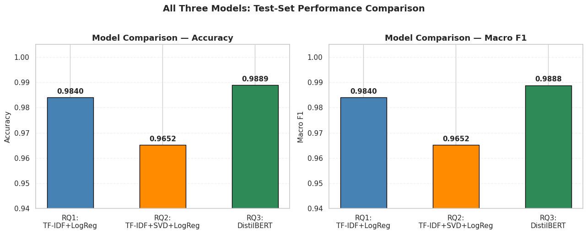

# Does Context Actually Matter for Text Classification?

👉 Start here: [main_notebook.ipynb](./main_notebook.ipynb)

This project compares classical bag-of-words pipelines (TF‑IDF + Logistic Regression) with contextual transformer fine‑tuning (DistilBERT) on the DBpedia 14 Wikipedia benchmark to answer when and why context helps. We run a three-stage study (TF‑IDF baseline, SVD compression test, DistilBERT sample-efficiency and full-data experiments), provide EDA, explainability (LIME), and a reproducible Colab-first workflow so reviewers can reproduce the results quickly.

Project video (watch first) 🎥

https://www.youtube.com/watch?v=tJMxr0M0WzE

---

1) Deliverable

👉 The main deliverable is [main_notebook.ipynb](./main_notebook.ipynb) — open that file first and run top → bottom in Google Colab (GPU recommended for RQ3). Checkpoints live in `checkpoints/`.

---

2) Research questions

- RQ1 — How well does TF‑IDF + Logistic Regression perform on DBpedia 14?

   This question establishes a fast, interpretable baseline using bag-of-words features and a linear classifier; it measures how much signal exists without context.  The baseline guides whether a costly transformer fine-tune is justified in practice.

- RQ2 — Does compressing TF‑IDF features with TruncatedSVD help or hurt predictive performance?

   This probes whether dimensionality reduction can retain discriminative signal while speeding models and reducing memory.  A negative result shows that rare but informative tokens matter and that aggressive compression risks harming accuracy.

- RQ3 — Does a contextual model (DistilBERT) outperform TF‑IDF, and how many labeled examples are needed to match or exceed the baseline (8K vs full)?

   This measures the value of context: sample-efficiency (can a small fine-tune beat TF‑IDF) and ceiling performance (full-data fine-tune).  The result informs trade-offs between annotation cost, compute, and final accuracy.

---

3) Data

- DBpedia 14 is a standard 14-class benchmark of Wikipedia article titles and short abstracts (used widely for multi-class text classification). The dataset contains ~560k training examples and ~70k test examples, with each row providing a label, title, and abstract.

- A Drive mirror is available if you prefer a local copy:
   - Drive mirror (direct download): [Dataset](https://drive.google.com/uc?export=download&id=0Bz8a_Dbh9QhbQ2Vic1kxMmZZQ1k)


- Preprocessing (high level — fully implemented in `main_notebook.ipynb`):

- File discovery: notebook prefers local CSVs under `dbpedia_csv/` (or `data/dbpedia_csv/`), otherwise loads from HuggingFace and falls back to the Drive mirror via `gdown`.
- Robust CSV parsing: `safe_read_csv()` handles plain and gzipped CSVs, uses a tolerant CSV reader, and enforces columns `[label, title, text]` to avoid misaligned files.
- Text assembly: `title` and `text` are concatenated with a separator (`". "`) to form the model input.
- Label handling: labels normalized to 0–13 (0-based) with an assertion that the final label set is contiguous and size 14.
- Filtering: remove null/very-short texts (<5 chars) to avoid noisy examples.
- Splits: stratified 80/20 split; create a stratified 8K training subset for the sample-efficiency DistilBERT experiment.
- Tokenization: DistilBERT tokenizer with `max_length=128`, `padding='max_length'`, `truncation=True` (chosen after EDA showed minimal loss).
- Safety checks: assertions after each stage (class counts, nulls, stratification balance) to fail fast if something goes wrong.

---

4) How to reproduce (Colab-first, step-by-step)

-  Open `main_notebook.ipynb` in Google Colab.
-  (Optional) Mount Google Drive if you want to persist downloads or save models:

```python
from google.colab import drive
drive.mount('/content/drive')
# set DRIVE_ROOT = '/content/drive/MyDrive/dbpedia_csv' if you want persistent storage
```
- Change runtime type → GPU (T4 recommended) for DistilBERT fine-tuning.
- Install dependencies (or run the notebook helper cell which installs core libs):

```bash
!pip install -r requirements.txt
```

- Recommended run order:
- Run EDA and RQ1 (TF‑IDF + Logistic Regression) first — fast on CPU.
- Run RQ2 (TF‑IDF + SVD) next if you want the compression baseline.
- Run RQ3 DistilBERT: first the 8K stratified fine-tune (short) then the full-data fine-tune (long). Use Colab GPU for both.

- Export exact Colab environment for bit-for-bit reproducibility (run near the notebook end):

```python
!pip freeze > requirements.txt
from google.colab import files
files.download('requirements.txt')
```

Record the Python version as well:

```python
!python --version
```

- (Optional) Extract notebook figures into `assets/` for easy review:

```bash
python scripts/extract_images_from_notebook.py --notebook main_notebook.ipynb --outdir assets
```

Notes: avoid committing large CSVs or model weights to GitHub; use Git LFS or external hosting and update `data/README.md` with links.

---

5) Key dependencies (high-level)

- Python 3.11 (recommended in Colab)
- torch (GPU build recommended; notebook tested with torch==2.10.0+cu128)
- transformers==5.0.0
- datasets (HuggingFace) ~4.x
- scikit-learn==1.6.1
- pandas==2.2.2
- numpy==2.0.2
- matplotlib, seaborn
- lime (explainability)

Full dependency freeze should be exported from Colab to `requirements.txt` and committed for exact reproducibility.

---

6) Repo structure (short tree)

```
Next-Gen-NLP-Classifier-Using-Transformer-Models/
├── assets/                        # Extracted figures from the notebook
├── checkpoints/                   # Checkpoint notebooks
│   ├── checkpoint_1.ipynb
│   └── checkpoint_2.ipynb
├── data/                          # Placeholder + download instructions (do not commit large files)
├── dbpedia_csv/                   # (local) raw CSVs and model output — ignored by .gitignore
├── scripts/                       # Data helpers & image extraction tools
├── .gitignore               # helper for Git/GitHub auth (optional)
├── main_notebook.ipynb            # Curated final notebook (start here)
└── requirements.txt               # Exported from Colab (session-specific freeze recommended)
```

---

## Results & Conclusion — detailed takeaways

This section gives a concise, reproducible summary of the numeric results, important qualitative observations, and practical guidance for choosing a model for similar classification tasks.

Headline numbers (test set):

- TF‑IDF + Logistic Regression (RQ1): ~98.40% accuracy and comparable Macro F1. Training and evaluation are very fast (minutes on CPU) and require negligible GPU resources.
- TF‑IDF + TruncatedSVD (RQ2): ~96.5% accuracy — dimensionality reduction reduced signal from rare but discriminative tokens and increased confusion between related classes.
- DistilBERT (RQ3): fine-tuning on a stratified ~8K subset yields ~98.89% accuracy (strong sample-efficiency). Fine-tuning on the full training set produces a higher ceiling (~99.6%) but requires substantially more GPU time (order-of-magnitude slower; in our runs the full-data run took ~55× more wall-clock GPU time than the 8K run).

Per-class observations and failure modes:

- Several small classes (few-shot labels) show degraded recall in the TF‑IDF pipelines because they rely on rare tokens that get lost when using SVD or aggressive token pruning.
- DistilBERT improves per-class recall for classes with subtle contextual cues — it captures phrase-level patterns that TF‑IDF misses.
- The confusion matrices (see assets) show the most common confusions are semantically close classes (e.g., different types of companies or locations); these are good candidates for label-merging or hierarchical classification in future work.

Compute, time, and resource notes (reproducibility-friendly):

- Environment: experiments were run in Google Colab with a T4 GPU for transformer fine-tuning. The notebook records the Python and package versions; export `requirements.txt` from Colab to reproduce exact runtime.
- DistilBERT hyperparameters used for reported runs (notebook cells): seed=42, max_length=128, batch_size=16 (8 for GPU memory-limited runs), lr=2e-5, epochs=3 for 8K and epochs=2–3 for larger runs depending on learning curves.
- Checkpoints and model artifacts were saved to an output directory (the notebook uses a `checkpoints/` folder). Avoid committing large checkpoints to GitHub — use Drive or S3 for storage and link them in `data/README.md`.

Practical recommendations (actionable):

- Quick evaluation / baseline: Run TF‑IDF + Logistic Regression first (minutes) to establish a reliable lower bound.
- If you have GPU and <50k labels: fine-tune DistilBERT on a stratified 8K subset to measure sample-efficiency gains before committing to a full fine-tune.
- If the final accuracy gain is small (<0.5 percentage point) but cost is high, prefer TF‑IDF for production (faster, cheaper, interpretable).
- Use per-class error analysis (confusion matrices and LIME explanations in the notebook) to decide if label consolidation or targeted data collection is more effective than wholesale model replacement.

Visual highlights (extracted from the notebook):

Summary comparison (table):

| Model | Val/Test Accuracy | Val/Test Macro F1 | Training Samples | Key Finding |
|---|---:|---:|---:|---|
| Stage 1: TF‑IDF + LR | 98.40% | 98.4% | ~448,000 | Strong, fast — but context‑blind |
| Stage 2: TF‑IDF + SVD | 96.5% | 96.5% | ~448,000 | Compression makes things worse |
| Stage 3: DistilBERT (8K) | 98.89% | 98.88% | ~8,000 | Exceeds Stage 1 with 56× less data |
| Stage 3: DistilBERT (Full 448K) | 99.65% | 99.65% | 448,000 | Transfer learning ceiling at scale |

- Performance breakdown (per-class): `assets/060-detailed-performance-breakdown-by-class.png`


- Cross-model comparison (accuracy vs F1): `assets/090-phase-8-cross-model-comparison.png`


## Future work — short actionable directions


- k-fold cross-validation on the 8K DistilBERT experiments — run 5‑fold stratified CV to report mean ± CI and surface high‑variance classes.

   What: Train DistilBERT across 5 stratified folds on the 8K subset and record per-fold accuracy and Macro F1.
   How: Reuse the notebook training loop inside a fold loop, save metrics to CSV, and compute mean, std, and 95% CIs.
   Outcome: Produce robust error bars, flag unstable classes, and confirm whether the 8K advantage is statistically reliable.

- Parameter‑efficient fine‑tuning (LoRA / adapters) — evaluate LoRA/adapters to reduce GPU/time at near-equivalent accuracy.

   What: Replace full-parameter updates with LoRA or adapter modules and re-run 8K and full-data experiments.
   How: Integrate a small LoRA/adapter wrapper around DistilBERT in the notebook and measure GPU memory, runtime, and accuracy trade-offs.
   Outcome: Expect similar accuracy with 5–10× lower compute or memory usage, making full-data runs cheaper.

- Targeted augmentation for low‑recall classes — use back‑translation/paraphrasing or synonym injection to boost recall for rare labels.

   What: Generate synthetic examples for low-recall classes using back-translation or paraphrase models and add them to training folds.
   How: Implement a small augmentation pipeline in the notebook (or use nlpaug/backtranslation APIs) and compare per-class recall before/after augmentation.
   Outcome: Improved recall for rare classes with minimal impact on common-class precision, validating cost-effective labeling strategies.

- Calibration & confidence‑based rejection — calibrate probabilities and add a reject option to reduce high‑impact overconfident errors in deployment.

   What: Evaluate calibration (temperature scaling / isotonic) and add a reject threshold or abstention policy for low-confidence predictions.
   How: Fit a calibration layer on validation logits, compute expected calibration error (ECE), and measure precision/recall with different rejection thresholds.
   Outcome: Better-calibrated probabilities, fewer high-cost mistakes in production, and a recommended reject-policy for deployment.

---

