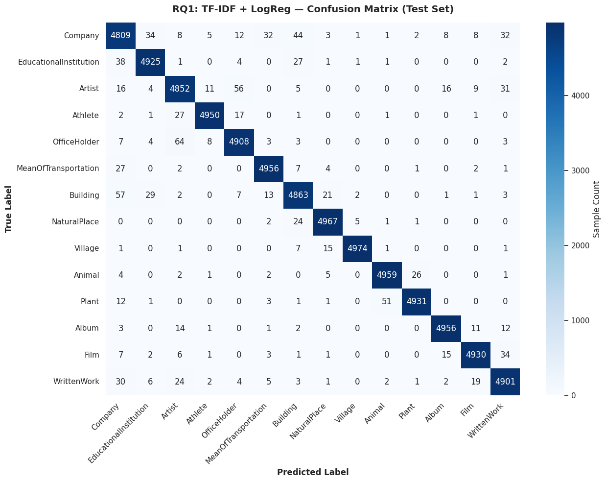

# 🤖 Does Context Actually Matter for Text Classification?
## A Three-Stage Data-Driven Investigation on 560,000 Wikipedia Articles

**Course:** CSCE 676 — Data Mining  

**Dataset:** [DBpedia 14-Class Ontology Classification — 560K Wikipedia article abstracts](https://drive.google.com/uc?export=download&id=0Bz8a_Dbh9QhbQ2Vic1kxMmZZQ1k)

**GitHub:** [Next-Gen-NLP-Classifier-Using-Transformer-Models](https://github.com/srijapentyala/Next-Gen-NLP-Classifier-Using-Transformer-Models)

> *"In the age of transformers, everyone assumes you need a GPU. This project answers when that assumption is actually correct — with 560,000 data points, not conference paper hype."*

Wikipedia's DBpedia project organizes over 6 million entities into ontological categories. Automatically assigning any piece of text to one of 14 top-level categories — Company, Animal, Film, Athlete, etc. — enables smarter search, better knowledge-graph curation, and faster cross-lingual entity linking. This project uses that challenge to answer a foundational question in modern NLP: **does reading words *in context* actually improve classification — or is knowing *which* words appear enough?**

---

## 👉 Start Here: [`main_notebook.ipynb`](main_notebook.ipynb)

The main deliverable is **`main_notebook.ipynb`** — a curated, narrative-driven notebook that walks through all ten phases of the project, from environment setup and EDA through every model, cross-model comparison, LIME explainability, and the final conclusions.

---

## 🎥 Project Video

**[▶ Watch the Project Walkthrough on YouTube](https://youtu.be/tJMxr0M0WzE?si=o4YTgmM3AhyMhFCr)**

---

## 🔬 Research Questions

This project is organized around three research questions, each answered by a dedicated modeling stage:

| RQ | Question | Technique | Test Accuracy / Macro F1 |
|----|----------|-----------|--------------------------|
| **RQ1** | How far can word frequencies alone take us? | TF-IDF + Logistic Regression | **98.4%** |
| **RQ2** | Can compressing features into topics help? | TF-IDF + Truncated SVD | 96.5% |
| **RQ3** | Does reading words in context close the gap? | Fine-Tuned DistilBERT | **98.9%** |

---

## 📂 Dataset

**Name:** DBpedia 14-Class Ontology Classification Dataset  
**Source:** [HuggingFace `dbpedia_14`](https://drive.google.com/uc?export=download&id=0Bz8a_Dbh9QhbQ2Vic1kxMmZZQ1k)  
**Original paper:** Auer et al., 2007 — *DBpedia: A Nucleus for a Web of Open Data*

### Structure

Each record contains an article title and abstract mapped to one of 14 top-level ontological categories:

| Column | Content |
|--------|---------|
| Label | Integer 0–13 |
| Title | Wikipedia article title |
| Content | Wikipedia article abstract |

### The 14 Ontology Classes

```
Company | EducationalInstitution | Artist | Athlete | OfficeHolder
MeanOfTransportation | Building | NaturalPlace | Village | Animal
Plant | Album | Film | WrittenWork
```

### Size

- **Total training samples:** 560,000 (40,000 per class — perfectly balanced)
- **Total test samples:** 70,000
- **Train split used (80%):** ~448,000 samples
- **Test split used (20%):** ~112,000 samples
- **Classes:** 14 (perfectly balanced)

### Downloading the Data

The dataset can be downloaded from HuggingFace or Google Drive. The notebook's Phase 1 (Environment Setup) handles this automatically and tries multiple download paths in sequence. Place the files at:

```
data/
├── train.csv
└── test.csv
```

### Preprocessing

All preprocessing is done inside `main_notebook.ipynb` Phase 2. Key steps:

1. Assign column names (`label`, `title`, `content`)
2. Concatenate `title + ". " + content` into a single `text` field
3. Normalize labels from 1–14 to 0–13 (required by sklearn and PyTorch)
4. Strip empty-abstract rows
5. Apply a stratified 80/20 train-test split (seed 42) — preserves perfect class balance

---

## ▶️ Reproducibility

This project was developed in **Google Colab** (A100 GPU for DistilBERT training).

### Quick Start

1. Open [Google Colab](https://colab.research.google.com/) and upload (or open from GitHub) `main_notebook.ipynb`
2. Go to **Runtime → Change runtime type → T4 GPU** (required for Phase 7 DistilBERT training)
3. Run all cells top to bottom — the notebook auto-detects paths and downloads the dataset

### Install Dependencies

Dependencies are installed automatically in the first cell. To install manually:

```python
!pip install transformers datasets accelerate scikit-learn pandas matplotlib seaborn lime -q
```

Or install from the full requirements file:

```bash
pip install -r requirements.txt
```

### Reproducibility Guarantees

All random seeds are fixed at `42` — Python, NumPy, PyTorch CPU and GPU produce identical outputs on every run. Dataset paths auto-detect across Google Colab and local environments — no manual path editing required.

### Run Order

| Step | File | Description |
|------|------|-------------|
| 1 | `checkpoints/checkpoint_1.ipynb` | Dataset exploration and selection |
| 2 | `checkpoints/checkpoint_2.ipynb` | Research question formalization and experimental design |
| 3 | `main_notebook.ipynb` | Full pipeline — EDA through conclusions |

### Runtime Note

DistilBERT training on the full 448K dataset is computationally intensive (multi-hour without A100). The notebook includes reported results and a sample-efficient 8K run that finishes in ~30–60 seconds on a T4 GPU.

---

## 🔑 Key Dependencies and Versions

Python version: **3.x (Google Colab default)**

| Package | Used For |
|---------|---------|
| pandas | Data loading and manipulation |
| numpy | Numerical operations |
| scikit-learn | TF-IDF, Logistic Regression, SVD, metrics |
| matplotlib | Visualizations |
| seaborn | Heatmaps and EDA plots |
| scipy | Scientific computing utilities |
| transformers | DistilBERT (HuggingFace) |
| datasets | HuggingFace dataset utilities |
| accelerate | HuggingFace Trainer GPU support |
| torch | PyTorch backend for DistilBERT |
| lime | Local Interpretable Model-Agnostic Explanations |
| tqdm | Progress reporting |

The complete list of every package and version from the Colab session lives in [`requirements.txt`](requirements.txt).

---

## 🗂️ Checkpoint Notebooks

| Notebook | Contents |
|----------|----------|
| [`checkpoints/checkpoint_1.ipynb`](checkpoints/checkpoint_1.ipynb) | Three candidate datasets evaluated (DBpedia, AG News, Amazon Reviews); DBpedia selected; initial EDA and data quality assessment |
| [`checkpoints/checkpoint_2.ipynb`](checkpoints/checkpoint_2.ipynb) | Research questions formalized; experimental framework designed; hypotheses stated with EDA support |

---

## 📁 Repo Structure

```
Next-Gen-NLP-Classifier-Using-Transformer-Models/
│
└── assets/
    ├── detailed-performance-breakdown-by-class.png
    └── 090-phase-8-cross-model-comparison.png
         ....
├── checkpoints/
│   ├── checkpoint_1.ipynb       # Checkpoint 1: Dataset selection & initial EDA
│   └── checkpoint_2.ipynb       # Checkpoint 2: Research questions & experimental design
│
├── data/
│   README.md(instructions to download and work with data)
│
├── scripts/
│  ├── extract_images_from_notebook.py      # To extract all images from notebook
│  ├──rename_assets_by_notebook_context.py  #Rename assets figure names
├── main_notebook.ipynb
├── requirements.txt  

```

---

## 📊 Results Summary

The final notebook makes a clear case for a nuanced conclusion: **on clean, balanced, keyword-rich Wikipedia text, classical word-frequency methods are competitive with modern transformers in raw accuracy — but DistilBERT achieves the same performance with 56× less labeled data.** The true transformer advantage lives in sample efficiency, not peak accuracy on well-structured text.

### Final Results Scorecard

| Model | Val/Test Accuracy | Val/Test Macro F1 | Training Samples | Key Finding |
|---|---:|---:|---:|---|
| Stage 1: TF‑IDF + LR | 98.40% | 98.4% | ~448,000 | Strong, fast — but context‑blind |
| Stage 2: TF‑IDF + SVD | 96.5% | 96.5% | ~448,000 | Compression makes things worse |
| Stage 3: DistilBERT (8K) | 98.89% | 98.88% | ~8,000 | Exceeds Stage 1 with 56× less data |
| Stage 3: DistilBERT (Full 448K) | 99.65% | 99.65% | 448,000 | Transfer learning ceiling at scale |

### Main Takeaways

- **TF-IDF + Logistic Regression is a remarkably strong baseline** — 98.4% Macro F1 in ~2 CPU minutes with no neural components.
- **SVD compression makes things worse**, confirming the problem is context-blindness, not sparsity. Rare, category-specific words (\"species\", \"directed\", \"founded\") are discarded by SVD but are exactly what TF-IDF exploits.
- **DistilBERT matches TF-IDF's accuracy with 56× less labeled data**, proving that transfer learning's real advantage is in the low-label regime, not raw accuracy on abundant-data benchmarks.
- **DistilBERT fine-tuned on the full dataset edges ahead** to ~99.65%, but the marginal gain must be weighed against 50× more training data and GPU compute.
- **The EDA prediction was verified**: classes sharing biographical vocabulary (Artist, Athlete, OfficeHolder) were identified as the hardest before any model was trained — and they were.
- **LIME explainability reveals two different strategies**: TF-IDF relies on 4–6 keyword anchors per prediction; DistilBERT uses distributed contextual features that are more robust to vocabulary variation.

### Per-class performance breakdown

This per-class view shows where TF-IDF struggles most. The confusions concentrate along Artist ↔ Athlete ↔ OfficeHolder — exactly the biographical classes that EDA §3.5 predicted would be hardest — while technically-distinct classes like MeanOfTransportation, Animal, and Album achieve near-perfect scores.

- Performance breakdown (per-class): `assets/detailed-performance-breakdown-by-class.png`



### Cross-model comparison (Accuracy vs. F1)

This figure shows the full leaderboard comparison across all three stages. Stage 2 (SVD) drops below the classical baseline, Stage 1 and Stage 3 (8K) tie at 98.4%, and Stage 3 on the full dataset reaches the ceiling performance.

- Cross-model comparison (accuracy vs F1): `assets/090-phase-8-cross-model-comparison.png`


**Central conclusion:** On clean, structured Wikipedia text, context provides a sample-efficiency advantage rather than an accuracy advantage. TF-IDF+LR is the right choice when you have abundant labeled data and no GPU; DistilBERT is the right choice when your label budget is tight or your text is noisy and contextually ambiguous.

---

## ⚠️ Limitations

- **Single dataset:** DBpedia is unusually clean and balanced. On noisier domains (social media, OCR text, medical records), transformer advantages would likely be larger and more consistent.
- **Single split:** Metrics are computed from one stratified 80/20 split (RQ1/RQ2) and a separate 10% internal validation split for DistilBERT (RQ3). k-fold cross-validation would provide confidence intervals, especially important for the 8K DistilBERT run.
- **Compute constraints:** The 8K DistilBERT subset was chosen for GPU tractability on Colab. Full fine-tuning on ~448K samples shows stronger results but requires significantly more compute.
- **No production drift testing:** The notebook focuses on model quality, not long-term data drift, latency at scale, or real-time monitoring after deployment.
- **Domain dependence:** Results are optimized for the DBpedia ontology space; performance may shift for a different label set or writing style.

---

## 🚀 Practical Deployment

### Recommended Deployment Path

The right model depends on your data characteristics and label budget:

| Scenario | Recommended Model | Justification |
|----------|------------------|---------------|
| No GPU; real-time inference | **TF-IDF + LR** | ~2 min training, microsecond prediction, fully interpretable |
| GPU available; limited labels (< 50K) | **DistilBERT** | Matches TF-IDF performance with 56× less labeled data |
| GPU available; full dataset | **DistilBERT (full fine-tune)** | ~99.65% ceiling performance |
| Noisy user-generated text | **DistilBERT** | Contextual robustness handles vocabulary variation TF-IDF cannot |

### Decision Framework

```
What is your label budget?
├── ≥ 50,000 labeled examples  →  TF-IDF + LogReg
│   Cost: $0 (CPU only) | Accuracy: 98.4% | Interpretable
└── < 50,000 labeled examples  →  DistilBERT
    Cost: $1–10 GPU | Accuracy: same | 56× data efficiency

Is your text noisy (typos, slang, ambiguous context)?
├── Clean (Wikipedia, formal docs)  →  TF-IDF competitive
└── Noisy (social media, OCR, user-generated)  →  DistilBERT advantage grows
```

### Suggested Production Workflow

1. Accept an article title and abstract as input.
2. Normalize text using the same preprocessing used in `main_notebook.ipynb` (concatenate, normalize whitespace).
3. Route through a saved TF-IDF/LR bundle (fast path) or DistilBERT inference endpoint (quality path).
4. Return the predicted ontology class plus confidence scores.
5. Log predictions and low-confidence examples for review and future retraining.

---

## 🔮 Future Scope

- **Error analysis:** Build a confusion-focused analysis to understand where class overlap still hurts performance, which examples are ambiguous, and whether certain label pairs (Artist/Athlete, Company/EducationalInstitution) are structurally hard to separate.
- **Noisy domain transfer:** Evaluate the same three-stage pipeline on noisier datasets (user-generated text, OCR output) to quantify how much the transformer advantage grows when vocabulary is less structured.
- **Larger transformer baselines:** Compare DistilBERT against full BERT-base and RoBERTa to test whether the additional parameters meaningfully close the remaining per-class spread.
- **Robust evaluation:** Replace the single split with k-fold cross-validation to obtain confidence intervals on every metric comparison, especially for the 8K DistilBERT run where variance could be meaningful.
- **Model efficiency:** Explore quantization and mixed-precision inference to reduce DistilBERT's inference cost without sacrificing classification accuracy.
- **Topic discovery:** Use BERTopic or LDA to uncover within-class subtopic structure (e.g., different types of Films or Animals) that the coarse 14-label schema hides.

---

## 📚 References

1. Devlin, J., Chang, M.-W., Lee, K., & Toutanova, K. (2019). BERT: Pre-training of Deep Bidirectional Transformers for Language Understanding. *arXiv:1810.04805*.
2. Sanh, V., Debut, L., Chaumond, J., & Wolf, T. (2019). DistilBERT, a distilled version of BERT. *arXiv:1910.01108*.
3. Ribeiro, M.T., Singh, S., & Guestrin, C. (2016). "Why Should I Trust You?": Explaining the Predictions of Any Classifier. *KDD 2016*.
4. Auer, S., et al. (2007). DBpedia: A Nucleus for a Web of Open Data. *ISWC 2007*.
5. Zhang, X., Zhao, J., & LeCun, Y. (2015). Character-level Convolutional Networks for Text Classification. *NeurIPS 28*.
6. Joachims, T. (1998). Text Categorization with Support Vector Machines. *ECML 1998*.
